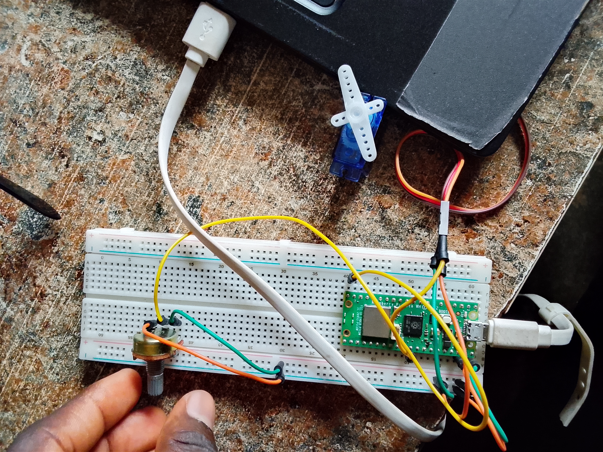

# Servo-Control-With-Potentiometer-Pico-W

## Description

This project demonstrates how to control a servo motor using a potentiometer and a Raspberry Pi Pico W.

The potentiometer is connected to an analog input pin and continuously provides varying voltage levels. The Raspberry Pi Pico W reads these values, converts them into servo angles, and moves the servo motor accordingly.

As the potentiometer knob is rotated, the servo motor follows the movement in real time.

## Components Used

- Raspberry Pi Pico W
- Servo Motor
- Potentiometer
- Jumper Wires
- USB Cable

## Wiring

| Component | Raspberry Pi Pico W |
|------------|--------------------|
| Servo Signal | GP15 |
| Servo VCC | 5V (VBUS) |
| Servo GND | GND |
| Potentiometer Middle Pin | GP26 (ADC0) |
| Potentiometer VCC | 3.3V |
| Potentiometer GND | GND |



## Project Demo video

[Click here to check out the project demo video](https://youtube.com/shorts/bgnVgXuFDGI?feature=share)

## Project code file

[Click here to download the project file](code/controlling_the_servo_motor_with_raspberry_pi_pico_w_project.py)

## Code

```python
import machine
from time import sleep as s

servopin = 15
potpin = 26

pot = machine.ADC(machine.Pin(potpin))
servo = machine.PWM(machine.Pin(servopin))
servo.freq(50)

while True:
    potval = pot.read_u16()
    print(potval)
    s(.5)

    angle = (180/65535) * potval
    writeval = 6553/180 * angle + 1638

    servo.duty_u16(int(writeval))
```

## How It Works

- The potentiometer generates an analog voltage.
- The Pico W reads the voltage using its ADC.
- The ADC value is converted into an angle between 0° and 180°.
- The angle is converted into a PWM duty cycle.
- The servo motor moves to the corresponding position.
- Rotating the potentiometer changes the servo position instantly.

## Features

- Analog input using ADC
- Real-time servo control
- Potentiometer-based positioning
- PWM signal generation
- Interactive hardware control

## Output

Example ADC Values:

```
12500
28750
45100
62000
```

As the potentiometer value changes, the servo motor rotates to different positions.

## Learning Objectives

- Understanding ADC (Analog-to-Digital Conversion)
- Reading analog sensors with Raspberry Pi Pico W
- Servo motor control using PWM
- Converting sensor values into physical movement
- Embedded systems programming with MicroPython

## Author

Moses Olorunfemi Kolawole
